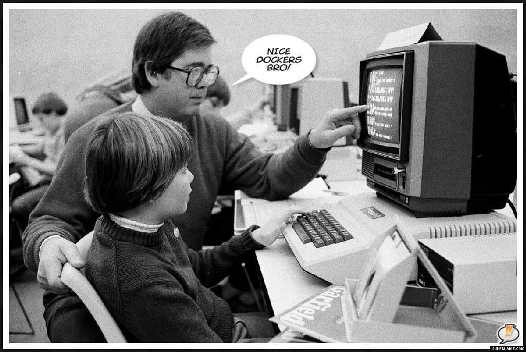

#### UCI Docker Day

 | 
----|---

---

## Instructors

Anthony Ramirez | Richard Laub

---

# Richard's Story

+++

## Before


+++

## After



+++

## First day of class


+++

## Fellow Student without Docker
```
$ pip install anaconda
bash: pip: command not found
```

## Me with Docker

```
$ docker run -it -p 8888:8888 \
> continuumio/anaconda \
> jupyter notebook --ip="*'
```

+++

## Fellow Student


+++

## Me


---

## Exercises

For the exercises we'll be using [play-with-docker.com](play-with-docker.com)

We'll also need a Docker account. Sign up at [hub.docker.com](hub.docker.com)

+++

## Errata

Exercise 6.1

```
FROM ubuntu:14.04
# 14.04 already has ping installed for exercise 7
```

+++

## Errata

Exercise 8.1 

```
# Install java for alpine instead of apt-get
apk add -U openjdk7
# Move javac to your path
export PATH=$PATH:/usr/lib/jvm/java-1.7-openjdk/bin
```
