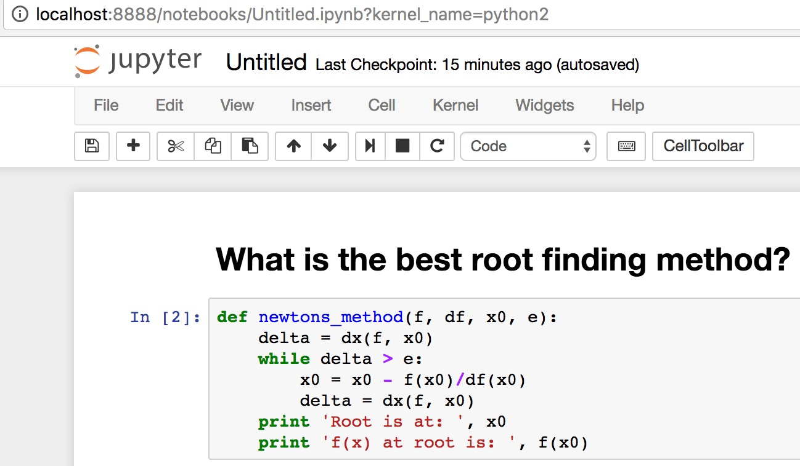

#### UCI Docker Day


---

## Instructors

Anthony Ramirez | Richard Laub

---

# Richard's Story

+++

## First day of class


+++

## Fellow Student - no docker :(
```
$ pip install anaconda
bash: pip: command not found
```

## Me - docker :)

```
$ docker run -it -p 8888:8888 \
> continuumio/anaconda \
> jupyter notebook --ip="*'
```

+++

## Fellow Student


+++

## Me

