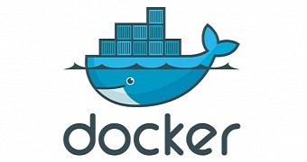

#### UCI Docker Day



---

## Instructors

Anthony Ramirez | Richard Laub

---

# Richard's Story

+++

## First day of class


+++

<table>
<tr>
    <td>Fellow Student</td>
    <td>Me</td>
</tr>
<tr>
    <td>
      <pre>
      pip install anaconda
      bash: pip: command not found
      </pre>
    </td>
    <td>
      <pre>
      docker run -it -p 8888:8888 \
      continuumio/anaconda \
      jupyter notebook --ip='*'
      </pre>
    </td>
</tr>
</table>

+++

## Other Student
```
$ pip install anaconda
bash: pip: command not found
```

```
$ docker run -it -p 8888:8888 \
> continuumio/anaconda \
> jupyter notebook --ip="*'
```

+++

## Other Student


+++

## Me

